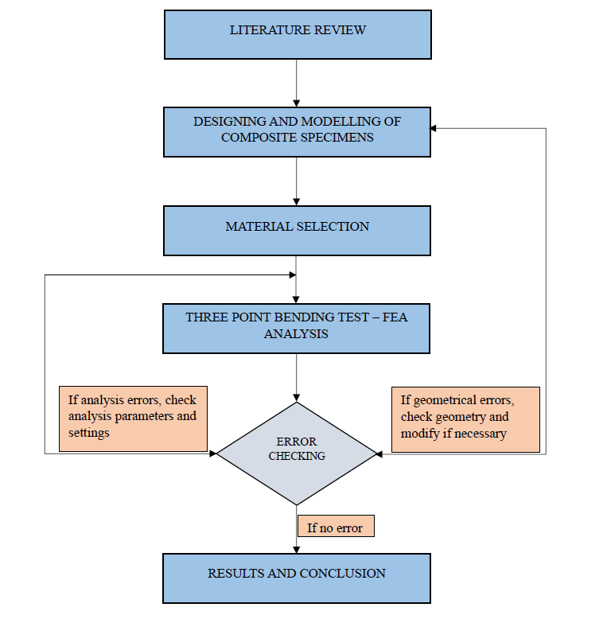

# Hierarchical-honeycomb-panel-design-and-analysis
 This study explores a **novel biomimetic honeycomb structure** inspired by natural hexagonal patterns found in honeycombs and spider webs. Using **SOLIDWORKS**, a conventional honeycomb core is designed, and three advanced honeycomb variants are developed. Each variant incorporates hierarchical hexagonal infill patterns interconnected by web-like frameworks resembling **spider cobwebs**.

The composite structure consists of:

Face Sheets: **Carbon Fibre-Polyether Ether Ketone (CF-PEEK)**
Core Material: **Aluminium 7075 T6**
Mechanical performance is evaluated through a **static three-point bending test** using ANSYS 2024 R1 to analyze flexural behavior, focusing on parameters like stiffness and weighted stiffness. Results are compared to conventional honeycomb designs, demonstrating:

Significant improvements in stiffness-to-weight ratio
Enhanced structural performance through geometric modifications
The findings highlight the effectiveness of biomimetic design principles in optimizing material performance for aerospace applications, where weight efficiency and structural integrity are paramount. By emulating natural geometries, this research paves the way for the development of innovative, high-performance materials that achieve a balance between strength, weight, and durability.

## Table of Contents  
1. [Project Overview](#project-overview)  
2. [Technologies Used](#technologies-used)  
3. [Methodology](#methodology)  
4. [Key Results](#key-results)  
5. [Screenshots/Demos](#screenshotsdemos)  
6. [License](#license)  

## Project Overview  
Describe the problem, your solution, and the impact.

## Technologies Used  
- *Design Softwares:* SOLIDWORKS, ANSYS SpaceClaim 2024
- *Simulation Softwares:* ANSYS 2024 R1
- *Documentation Softwares:* Microsoft Excel, LaTeX Overleaf

## Methodology  
Here is a flowchart for better understanding of the project workflow process and methodology.
  

## Key Results  
- Achievement 1  
- Achievement 2  

## Screenshots/Demos  
  

## Installation & Usage  
Steps to run the project.  

## License  
Licensed under MIT License.  
