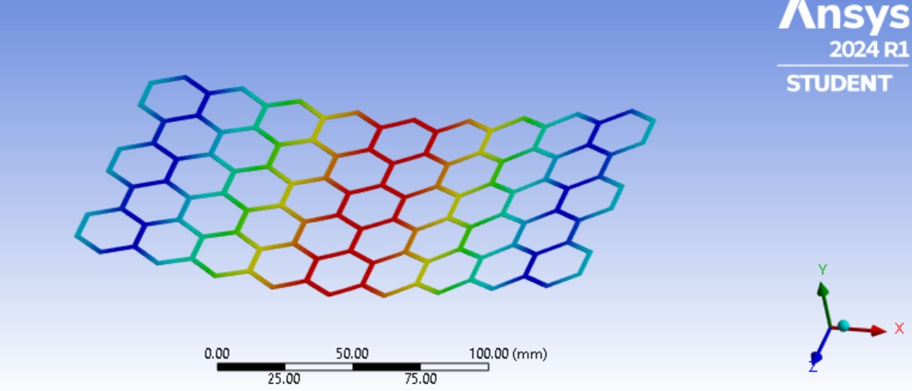
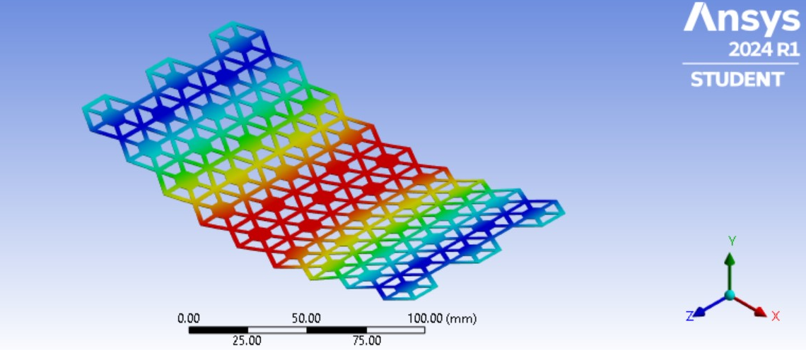
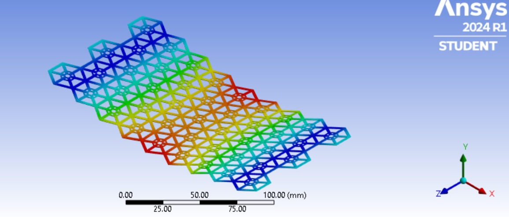
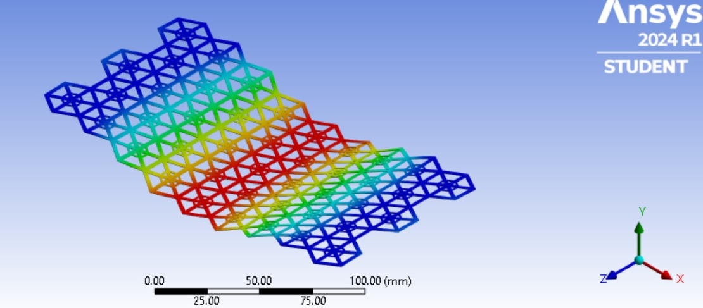

# Design, Analysis and Comparison of Biomimetic Hierarchical Honeycomb Sandwich Composites for Aerospace Applications
- This project is my Master Thesis Topic and I carried out my thesis at Politecnico di Milano, Milan, Italy
 This study explores a **novel biomimetic honeycomb structure** inspired by natural hexagonal patterns found in honeycombs and spider webs. Adopting these biomimetic principles, with the aid of primarily **SOLIDWORKS** and **ANSYS SpaceClaim 2024**, a conventional honeycomb core is designed, and three hierarchical honeycomb variants namely first order, second order and the third order are designed. The panels were assembled between face sheets for a sandwich composite specimen. Each variant incorporates hierarchical hexagonal infill patterns interconnected by web-like frameworks resembling **spider cobwebs**.

The composite structure consists of:

Face Sheets: **Carbon Fibre-Polyether Ether Ketone (CF-PEEK)**
Core Material: **Aluminium 7075 T6**
Mechanical performance is evaluated through a **static three-point bending test** using ANSYS 2024 R1 to analyze flexural behavior, focusing on parameters like stiffness and weighted stiffness. Results of each hierarchical honeycomb panel are compared to conventional honeycomb designs and the data is tabulated for comparison.

The findings highlight the effectiveness of biomimetic design principles in optimizing material performance for aerospace applications, where weight efficiency and structural integrity are paramount. By emulating natural geometries, this research paves the way for the development of innovative, high-performance materials that achieve a balance between strength, weight, and durability.

## Table of Contents  
1. [Project Overview](#project-overview)  
2. [Technologies Used](#technologies-used)  
3. [Methodology](#methodology)  
4. [Key Results](#key-results)  
5. [Screenshots](#screenshotsdemos)   

## Project Overview  
Describe the problem, your solution, and the impact.

## Technologies Used  
- *Design Softwares:* SOLIDWORKS, ANSYS SpaceClaim 2024
- *Simulation Softwares:* ANSYS 2024 R1
- *Documentation Softwares:* Microsoft Excel, LaTeX Overleaf

## Methodology  
Here is a flowchart for better understanding of the project workflow process and methodology.
  

## Key Results  
- Overall higher Strength - weight ratio was achieved in the hierarchical honeycomb panels when compared with the conventional honeycomb panel 
- There was a significant increase in the specific stiffness of the third order hierarchical honeycomb panel around 65% when compared with the conventional honeycomb panel. 

## Screenshots 
Some of the analysis screenshots are given below for a better visual understanding,

Core Deformation of Conventional Honeycomb

Core Deformation of First Order Hierarchical Honeycomb

Core Deformation of Second Order Hierarchical Honeycomb

Core Deformation of Third Order Hierarchical Honeycomb

**👤 About Me**  
For more about my background, projects, and contact details, check out my [GitHub profile](https://github.com/DinendraAV) or [LinkedIn](https://www.linkedin.com/in/dinendra-av/)
